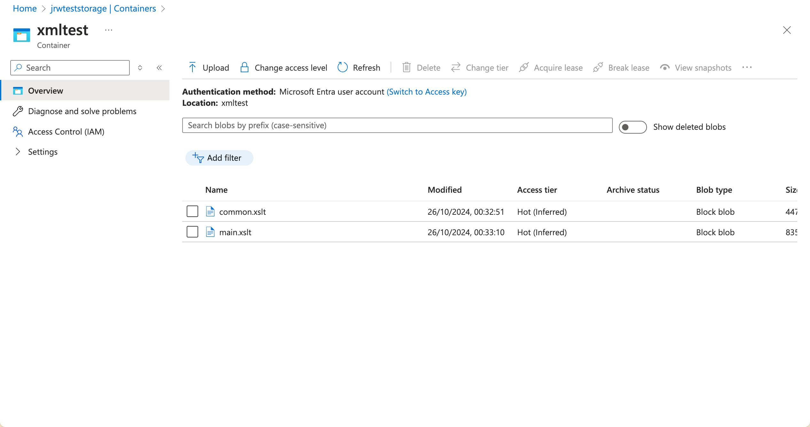

# Overview

This is a spike to test a custom XmlResolver that can pull files from Azure Blob Storage.

The demo incldues a sample parent XLST file `main.xslt.xml` that includes a child XSLT file `common.xslt.xml`. The custom XmlResolver is used to pull both files from Azure Blob Storage and transform a locally stored `books.xml` file into HTML.

The files are in the Example folder in src/Demo.

## Instructions

There are two set up sets before you run the example project:

You need to set the dotnet user secret for the `AzureBlobXmlResolver:ConnectionString` key to the connection string of the Azure Storage account:

```bash
dotnet user-secrets --project src/Demo set AzureBlobStrage:ConnectionString "<blob storage connection string>"
```

You need to upload the `common.xslt.xml` and `main.xslt.xml` files to an Azure blob storage container called `xmltest`.

It would look like:



From the command line, run `dotnet run --project src/Demo`.